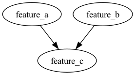

<h4 align="center">
    
</h4>
<h2>
    <p align="center">
     ⚙️ The Framework to Simplify and Scale Feature Engineering ⚙️
    </p>
</h2>

<p align="center">
    <a href="https://colab.research.google.com/drive/1O9i-g3vmxyazwdadTVjgBlY1GFN4f7Xt?usp=sharing">
        
    </a>
</p>

<p align="center">
    
    
    
    
    
    

</p>

For **data scientists, ML engineers**, and **AI researchers** who want to simplify feature engineering, manage complex dependencies, and boost productivity.

______________________________________________________________________

## Introduction

**Feature Fabrica** is an open-source Python library designed to improve engineering practices and transparency in feature engineering. It allows users to define features declaratively using YAML, manage dependencies between features, and apply complex transformations in a scalable and convenient manner.

By providing a structured approach to feature engineering, Feature Fabrica aims to save time, reduce errors, and enhance the transparency and reproducibility of your machine learning workflows. Whether you're working on small projects or managing large-scale pipelines, **Feature Fabrica** is designed to meet your needs.

## **Key Features**

- **📝 Declarative Feature Definitions**: Define features, data types, and dependencies using a simple YAML configuration.
- **🔄 Transformations**: Apply custom transformations to raw features to derive new features.
- **🔗 Dependency Management**: Automatically handle dependencies between features.
- **✔️ Pydantic Validation**: Ensure data types and values conform to expected formats.
- **🛡️ Fail-Fast with Beartype**: Catch type-related errors instantly during development, ensuring your transformations are robust.
- **🚀 Scalability**: Designed to scale from small projects to large machine learning pipelines.
- **🔧 Hydra Integration**: Leverage Hydra for configuration management, enabling flexible and dynamic configuration of transformations.

______________________________________________________________________

## 🛠️ Quick Start

### Installation

To install **Feature Fabrica**, simply run:

```bash
pip install feature-fabrica
```

### **Defining Features in YAML**

Features are defined in a YAML file. Here’s an example:

```yaml
feature_a:
  description: "Raw feature A"
  data_type: "float32"

feature_b:
  description: "Raw feature B"
  data_type: "float32"

feature_c:
  description: "Derived feature C"
  data_type: "float32"
  dependencies: ["feature_a", "feature_b"]
  transformation:
    sum_fn:
      _target_: feature_fabrica.transform.SumReduce
      iterable: ["feature_a", "feature_b"]
    scale_feature:
      _target_: feature_fabrica.transform.ScaleFeature
      factor: 0.5

```

### **Creating and Using Transformations**

You can define custom transformations by subclassing the Transformation class:

```python
from typing import Union
import numpy as np
from beartype import beartype
from numpy.typing import NDArray
from feature_fabrica.transform import Transformation
from feature_fabrica.transform.utils import NumericArray, NumericValue


class ScaleFeature(Transformation):
    def __init__(self, factor: float):
        super().__init__()
        self.factor = factor

    @beartype
    def execute(self, data: NumericArray | NumericValue) -> NumericArray | NumericValue:
        return np.multiply(data, self.factor)
```

### **Compiling and Executing Features**

To compile and execute features:

```python
import numpy as np
from feature_fabrica.core import FeatureManager

data = {
    "feature_a": np.array([10.0], dtype=np.float32),
    "feature_b": np.array([20.0], dtype=np.float32),
}
feature_manager = FeatureManager(
    config_path="../examples", config_name="basic_features"
)
results = feature_manager.compute_features(data)
print(results["feature_c"])  # 0.5 * (10 + 20) = 15.0
print(results.feature_c)  # 0.5 * (10 + 20) = 15.0
```

### Visualize Features and Dependencies

Track & trace Transformation Chains

```python
import numpy as np
from feature_fabrica.core import FeatureManager

data = {
    "feature_a": np.array([10.0], dtype=np.float32),
    "feature_b": np.array([20.0], dtype=np.float32),
}
feature_manager = FeatureManager(
    config_path="../examples", config_name="basic_features"
)
results = feature_manager.compute_features(data)
print(feature_manager.features.feature_c.get_transformation_chain())
# Transformation Chain: (Transformation: sum_fn, Value: 30.0 Time taken: 9.5367431640625e-07 seconds) -> (Transformation: scale_feature, Value: 15.0, Time taken:  9.5367431640625e-07 seconds)
```

Visualize Dependencies

```python
from feature_fabrica.core import FeatureManager

feature_manager = FeatureManager(
    config_path="../examples", config_name="basic_features"
)
feature_manager.get_visual_dependency_graph()
```



## **Contributing**

We welcome contributions to **Feature Fabrica**! If you have ideas for new features, improvements, or if you'd like to report issues, feel free to open a pull request or an issue on GitHub.

### How to Contribute

1. **Fork** the repository to your own GitHub account.
2. **Clone** your fork locally.
3. **Create a new branch** for your feature or fix.
4. **Commit your changes** with a clear and concise message.
5. **Push** to the branch.
6. **Open a pull request** from your fork to the original repository.

We look forward to your contributions! 😄
